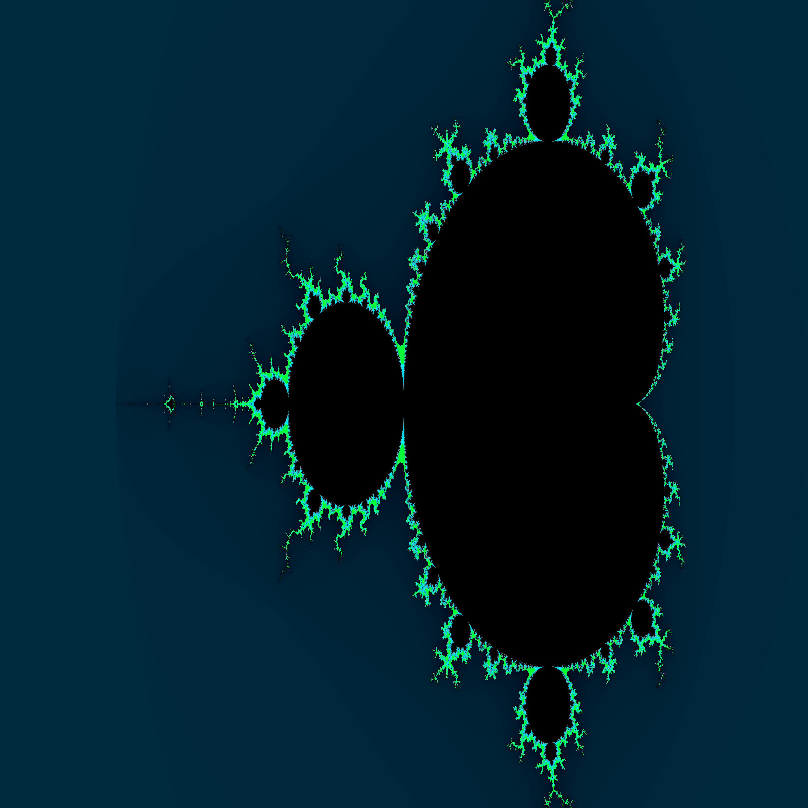

To build, run `make`. The program is built as `mandelbrot-set-generator`.

To test, run `./test.sh`. Some parameters can be set in that script.

## Descrição

O processo mestre escalona dinamicamente parcelas do trabalho entre trabalhadores. Isso é feito em `master.c`, na função `do_master_stuff`. Uma requisição de parcela de trabalho é descrita por uma instância de `struct job`, que especifica um intervalo de linhas da imagem a serem computadas.

Em `worker.c`, cada processo trabalhador recebe uma requisição de parcela de trabalho, a executa, e então envia o resultado ao processo mestre. Isso é feito em um laço, até que seja recebido um sinal do término da computação. Cada parcela de trabalho executada por um trabalhador consiste na computação de uma subsequência de linhas da imagem. Cada processo trabalhador distribui a execução de uma parcela de trabalho sobre múltiplos fluxos de execução: cada fluxo de execução computa uma subsubsequência de linhas. Essa distribuição é feita estaticamente, já que o custo de computação não tende a variar muito entre as linhas de uma mesma parcela de trabalho.

## Saída

